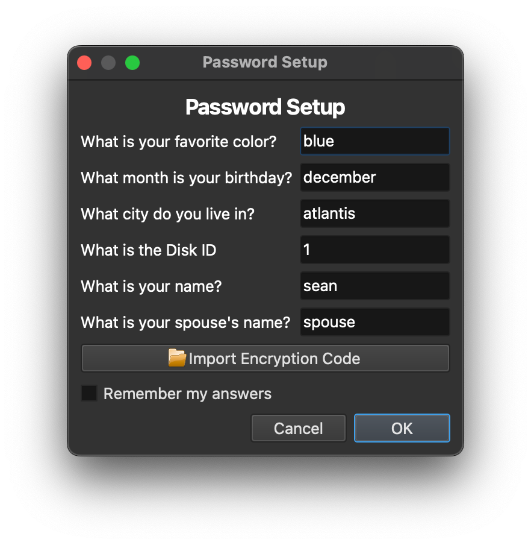
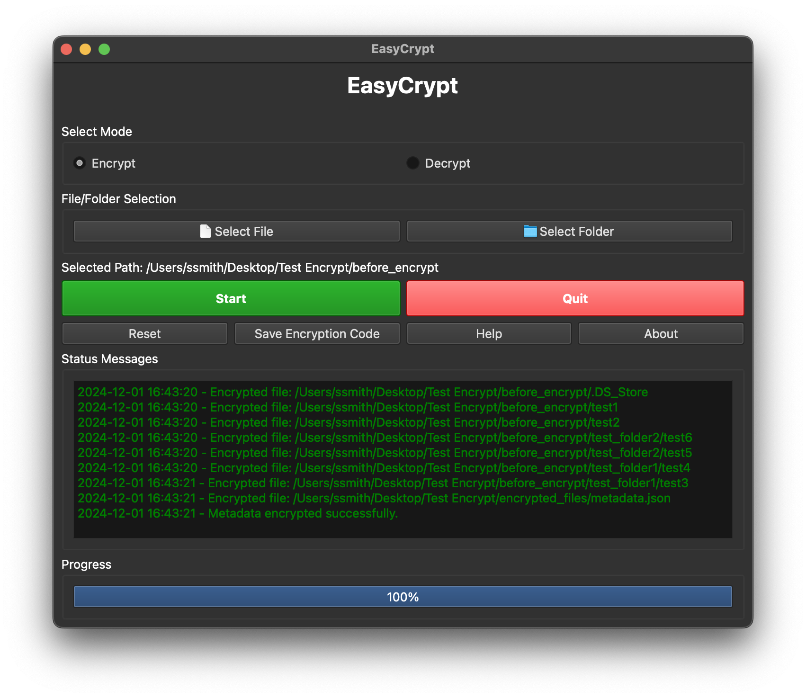
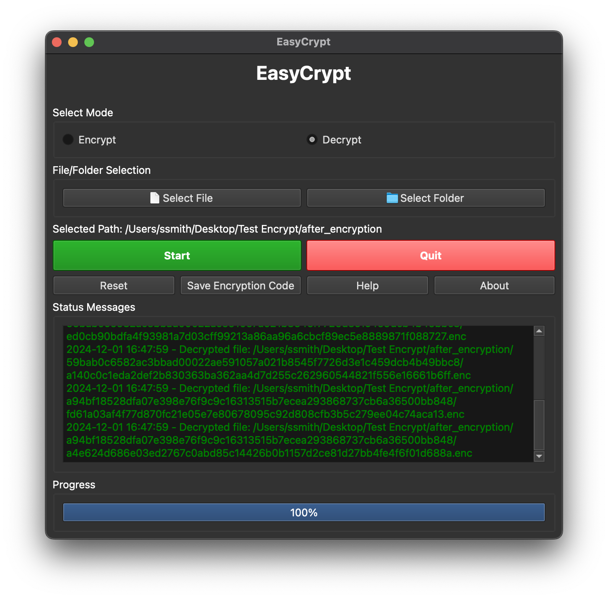

# EasyCrypt

## Description

EasyCrypt is a user-friendly encryption and decryption tool designed to securely encrypt and decrypt files and folders. It uses strong cryptographic algorithms to ensure data security and provides both a graphical user interface (GUI) and a command-line interface (CLI) for flexibility.

[Screenshots Below!](#screenshots)

### Why?

I have been backing up files/documents to CD-DVD disks to get closer to 3-2-1 Backup Methodology but quickly ran into a problem managing encryption keys while also making the encryption keys available to family. I had two options, use the same key for each disk but risk losing all the data if I forgot it, or have a new key for each disk but risk forgetting them. Of course, there was the option to not encrypt at all, but that is way too easy. 

I made this project to simplify the process of backing up and encrypting files using a list of questions and a unique id so I (and family members) would not have to risk forgetting a key and losing all the data.

My idea was to have a list of questions that any member in my family would have the same answer for plus an "id" for the data, hash those answers, and then generate a unique key. See [Password Generation](#Password-Generation) for more specifics. 

### Disclosure

I am sure there is an easier and more secure way of doing this, but for my use case, it works pretty well. I am also sure there is some logic error that makes the keys crackable by a very persistant actor, but my goal is to protect the data from any random person reading my documents. 

### Key Features

- **Strong Encryption**: Utilizes AES-GCM encryption for secure data protection.
- **Customizable Password Generation**: Generates encryption keys based on user-provided answers to personalized questions.
- **GUI and CLI Support**: Offers both graphical and command-line interfaces to cater to different user preferences.
- **Progress Tracking**: Provides real-time progress updates and status messages during encryption/decryption processes.
- **Password Management**: Allows users to save and import encryption codes, and reset passwords when needed.


## Example


Look in the [Tests Folder](tests/) for the files referenced below.

<details>
<summary>
Before Encryption
</summary>

### Before encryption

#### Output:
```
tests/before_encrypt
├── test1
├── test2
├── test_folder1
│   ├── test3
│   └── test4
└── test_folder2
    ├── test5
    └── test6
```

Encryption Key:
`9b924fd18445ed339392b143f435522a`

</details>


<details>
<summary>
After Encryption
</summary>

### After Encryption

Encrypted using these answers:



#### Output:
```
tests/after_encryption
├── 59bab0c6582ac3bbad00022ae591057a021b8545f7726d3e1c459dcb4b49bbc8
│   ├── a140c0c1eda2def2b830363ba362aa4d7d255c262960544821f556e16661b6ff.enc
│   └── ed0cb90bdfa4f93981a7d03cff99213a86aa96a6cbcf89ec5e8889871f088727.enc
├── a94bf18528dfa07e398e76f9c9c16313515b7ecea293868737cb6a36500bb848
│   ├── a4e624d686e03ed2767c0abd85c14426b0b1157d2ce81d27bb4fe4f6f01d688a.enc
│   └── fd61a03af4f77d870fc21e05e7e80678095c92d808cfb3b5c279ee04c74aca13.enc
├── e3b0c44298fc1c149afbf4c8996fb92427ae41e4649b934ca495991b7852b855
│   ├── 1b4f0e9851971998e732078544c96b36c3d01cedf7caa332359d6f1d83567014.enc
│   ├── 60303ae22b998861bce3b28f33eec1be758a213c86c93c076dbe9f558c11c752.enc
│   └── e2eb93a61ffd7877ea5c751abcb3a618e8e2e9a2073a27f66d4114fe10819f86.enc
└── metadata.json.enc
```


</details>
<details>
<summary>
After Decryption
</summary>

### After Decryption

#### Output:
```
tests/after_decryption
├── test1
├── test2
├── test_folder1
│   ├── test3
│   └── test4
└── test_folder2
    ├── test5
    └── test6
```



</details>

## How It Works

### Password Generation

The encryption password is generated based on the user’s answers to a set of questions. There are two types of questions:

1. **Order-Sensitive Questions (First Group):**
   - The answers to these questions are hashed in order, meaning the sequence matters.
   - **Example Questions:**
     - What is your favorite color?
     - What month is your birthday?
     - What city do you live in?

2. **Order-Insensitive Questions (Second Group):**
   - The answers are combined and sorted before hashing, so the order does not matter.
   - **Example Questions:**
     - What is your name?
     - What is your spouse’s name?

**Disk ID**: The Disk ID is a special question intended to change between encryption jobs. It allows users to keep the other answers the same while generating a different password for each job.

### Encryption Process

1. The user provides answers to the questions to generate an encryption password.
2. The user selects files or folders to encrypt or decrypt.
3. The tool processes the selected items, providing progress updates and logging messages.
4. Encrypted files and metadata are securely stored, and original filenames are obscured for added security.

## Usage Instructions

### GUI Mode

1. **Launch the Application**: Run the EasyCrypt executable.
2. **Password Setup**:
   - On startup, answer the questions to generate your encryption code.
   - Remember that the first group of questions is order-sensitive, while the names are order-insensitive.
   - The Disk ID should be changed for different encryption jobs if desired.
3. **Select Mode**: Choose between ‘Encrypt’ or ‘Decrypt’.
4. **Select Files/Folders**: Click ‘Select File’ or ‘Select Folder’ to choose the items to process.
5. **Start Process**: Click the green ‘Start’ button to begin encryption or decryption.
6. **Monitor Progress**: View real-time progress updates and status messages.
7. **Manage Password**:
   - Use ‘Reset’ to change your encryption code.
   - Use ‘Save Encryption Code’ to save your current encryption code to a file.
   - Use ‘Import Encryption Code’ on the password setup dialog to load a saved code.
8. **Exit**: Click the red ‘Quit’ button to exit the application.

### CLI Mode

1. **Run the Application in CLI Mode**: Execute `python easycrypt.py --cli`.
2. **Password Setup**: Answer the prompted questions to generate your encryption code.
3. **Select Mode**: Choose to encrypt or decrypt.
4. **Select Files/Folders**: Provide paths to the files or folders to process.
5. **Process Items**: The tool will encrypt or decrypt the selected items.
6. **Repeat or Exit**: Choose to process more items with the same or new password, or exit the application.


## Requirements

- **Python 3.6+**
- **Required Python Packages**:
  - `PyQt6`
  - `cryptography`
  - `rich` (optional, for enhanced CLI output)

## Installation

1. **Clone the Repository**:

   ```bash
   git clone https://github.com/pitterpatter22/EasyCrypt.git
   ```

2. **Install Dependencies**:

   ```bash
   pip install -r requirements.txt
   ```

## Building Executable

You can package the application into a standalone executable using PyInstaller:


   ```bash
   pyinstaller --onefile --windowed --collect-submodules PyQt6 easycrypt.py
   ```

<details>
<summary>
Screenshots
</summary>

## Screenshots


</details>